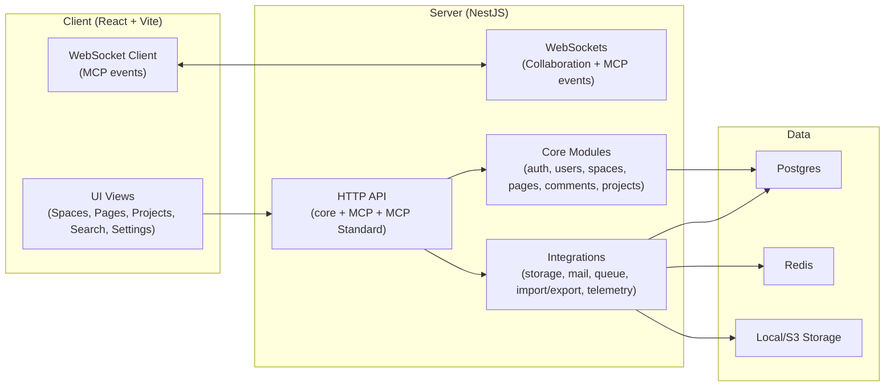
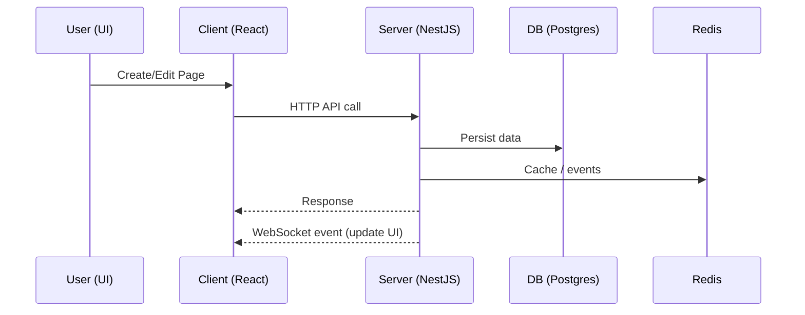

# Architecture Overview

This document describes the current Raven Docs architecture and system boundaries, with emphasis on the integrated MCP capabilities and real-time collaboration.

## System Overview

Raven Docs is a monorepo with two primary apps and shared packages:

- Backend: NestJS server (`apps/server`)
- Frontend: React + Vite client (`apps/client`)
- Shared packages: editor extension, MCP bridge, enterprise features (`packages/*`)

### High-Level Diagram



## Monorepo Layout

```
apps/
  client/            React UI (Vite)
  server/            NestJS API + WebSockets
packages/
  editor-ext/        Editor extension package
  mcp-bridge/        Legacy MCP bridge server
  ee/                Enterprise modules
docs/                Project and MCP documentation
```

## Backend Architecture (NestJS)

### Entry Points
- App module: `apps/server/src/app.module.ts`
- Main bootstrap: `apps/server/src/main.ts`

### Core Modules
Located under `apps/server/src/core`:
- `auth`, `user`, `workspace`, `space`, `page`, `comment`, `group`
- `search`, `attachment`, `project`
- Each module exposes controller(s), service(s), and repository layer.

### Integrations
Located under `apps/server/src/integrations`:
- `storage` (local or S3)
- `mail` (SMTP / Postmark)
- `queue`, `telemetry`, `security`, `health`
- `import`, `export`, `static`
- MCP:
  - Custom JSON-RPC MCP: `apps/server/src/integrations/mcp`
  - Standard MCP protocol: `apps/server/src/integrations/mcp-standard`

### Real-time Systems
- Collaboration via Hocuspocus/Yjs: `apps/server/src/collaboration`
- MCP event socket gateway: `apps/server/src/integrations/mcp/mcp-websocket.gateway.ts`

## Frontend Architecture (React)

### Entry Points
- App shell: `apps/client/src/App.tsx`
- Bootstrap: `apps/client/src/main.tsx`

### Feature Areas
Located under `apps/client/src/features`:
- `auth`, `space`, `page`, `comment`, `attachment`, `search`, `workspace`, `user`
- `project` (projects + tasks UI)
- `websocket` (MCP event subscriptions)

### Editor System
- Tiptap-based editor with extensions
- Shared editor extension package: `packages/editor-ext`

## MCP / AI Integration

Two paths exist:

1) Legacy MCP Bridge (`packages/mcp-bridge`)
   - Runs a separate MCP server process.
   - Translates MCP calls into Raven Docs JSON-RPC.

2) MCP Standard Integration (`apps/server/src/integrations/mcp-standard`)
   - Built-in server endpoints at `/api/mcp-standard/*`.
   - Uses existing MCP API key auth and internal MCP services.

## Data Flow Summary



## Current Status Notes

- Core systems are in place and wired.
- MCP Standard integration appears complete and is preferred over the legacy bridge.
- Project management system is implemented at API + UI, but several TODOs suggest partial UX completion.
- Documentation is partially inconsistent; several MCP docs overlap with different guidance.

## Known Gaps (from code scan)

- Permission TODOs in comments, search, and page scoping.
- Project/task UI has placeholders and TODOs (create/open editor, file operations, delete).
- Some docs refer to files that exist at repo root, not under `docs/`.
